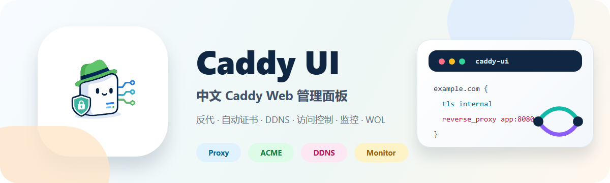

<p align="center">
  
</p>

<h1 align="center">Caddy UI</h1>

<p align="center">
  一个面向个人服务器、家庭网关和轻量反代节点的中文 Caddy Web 管理面板。
</p>

<p align="center">
  <a href="https://hub.docker.com/r/lc121a/caddy-ui"></a>
  
  
  
</p>

---

## 简介

**Caddy UI** 把定制版 Caddy、React 前端控制台和 Go 后端 API 打包到同一个容器中，用可视化方式管理反向代理、证书、动态 DNS、访问控制、通信规则、域名监控、推送通知和网络唤醒。

它更适合这类场景：

| 场景 | 你可以用它做什么 |
| --- | --- |
| 家庭服务器 | 管理 NAS、媒体服务、内网 Web 服务的公网入口 |
| 轻量反代网关 | 统一配置 HTTPS、证书、转发、访问控制和审计日志 |
| 动态公网 IP | 自动维护 DNS 记录，配合域名监控发现解析异常 |
| 免费域名托管 | 管理 DigitalPlat / DNSHE 域名提醒、续期和通知 |
| 局域网设备 | 保存设备 MAC 地址，一键发送 Wake-on-LAN 唤醒包 |

> [!IMPORTANT]
> 管理面板当前没有内置登录鉴权。生产环境请只允许内网/VPN 访问，或放在可信认证网关后面；不要把 Caddy Admin API `2019` 暴露到公网。

## 目录

- [功能亮点](#功能亮点)
- [快速开始](#快速开始)
- [端口说明](#端口说明)
- [核心功能](#核心功能)
- [持久化目录](#持久化目录)
- [环境变量](#环境变量)
- [从源码构建](#从源码构建)
- [本地开发验证](#本地开发验证)
- [安全建议](#安全建议)

## 功能亮点

| 模块 | 能力 |
| --- | --- |
| 站点管理 | 反向代理、重定向、404 站点、TCP/UDP Streams、多监听端口、审计日志 |
| 证书管理 | Caddy 自动 HTTPS、HTTP-01、DNS-01、自定义证书、Caddy Internal、自定义 ACME |
| DNS-01 | 阿里云 DNS、Cloudflare、DNSPod，支持 DNSPod 委派 Zone |
| 动态 DNS | 基于 Caddy Dynamic DNS 插件生成配置，自动同步域名解析 |
| 访问控制 | Basic Auth 访问列表、IP allow/deny、Authelia / authentik forward_auth |
| 通信规则 | 独立管理 TCP/UDP 转发规则，并关联到代理服务 |
| 域名监控 | DNS、SSL 证书到期、签发机构、域名注册到期、非 443 SSL 目标 |
| 域名续期 | DNSHE 手动续期和自动续期，DigitalPlat 到期提醒 |
| 推送通知 | Webhook、Bark、Server酱、Gotify、Telegram、企业微信、钉钉、飞书 |
| 网络唤醒 | 保存唤醒设备，一键发送 Wake-on-LAN 魔术包 |
| 凭据复用 | DNS、ACME、域名商和推送凭据统一保存到 `/config` |
| 多架构镜像 | 支持 `linux/amd64` 和 `linux/arm64` |

## 快速开始

### 方式一：Host 网络模式

这是仓库内 `docker-compose.yml` 当前使用的模式，适合需要直接监听宿主机 `80/443` 和自定义端口的网关场景。

```yaml
services:
  caddy:
    image: lc121a/caddy-ui:latest
    container_name: caddy-ui
    network_mode: host
    environment:
      - TZ=Asia/Shanghai
    volumes:
      - caddy_data:/data
      - caddy_config:/config
    restart: unless-stopped

volumes:
  caddy_data:
  caddy_config:
```

启动：

```bash
docker compose up -d
```

访问管理面板：

```text
http://<服务器 IP>:8888/
```

### 方式二：桥接网络模式

如果你不想使用 Host 网络，可以显式发布端口。反代里配置了额外监听端口时，也要同步发布对应端口。

```yaml
services:
  caddy:
    image: lc121a/caddy-ui:latest
    container_name: caddy-ui
    ports:
      - "8888:8888"     # 管理面板和 API
      - "80:80"         # HTTP 业务流量和 ACME HTTP-01
      - "443:443"       # HTTPS 业务流量
      # - "11111:11111" # 自定义监听端口
    environment:
      - TZ=Asia/Shanghai
    volumes:
      - caddy_data:/data
      - caddy_config:/config
    restart: unless-stopped

volumes:
  caddy_data:
  caddy_config:
```

## 端口说明

| 端口 | 用途 | 是否建议公网暴露 |
| --- | --- | --- |
| `8888` | 管理面板和后端 API | 不建议，推荐仅内网/VPN 访问 |
| `80` | 业务 HTTP、ACME HTTP-01 验证 | 需要 HTTP-01 时必须公网可达 |
| `443` | 业务 HTTPS | 按业务需要 |
| `2019` | Caddy Admin API | 不建议公网暴露 |
| 自定义端口 | 反代多监听端口，例如 `11111`、`8443` | 按业务需要 |

反代页面里的「监听端口」是 Caddy 容器内监听端口。例如填写：

```text
443,11111
```

桥接网络模式下需要同步发布：

```yaml
ports:
  - "443:443"
  - "11111:11111"
```

如果宿主机把 HTTPS 映射到非标准端口，例如 `"8443:443"`，外部访问地址就是 `https://example.com:8443/`，容器内仍监听 `443`。HTTP-01 证书申请仍要求外部能访问映射到容器 `80` 的端口。

## 核心功能

### 反向代理与站点

- 可视化管理反向代理、重定向、404 站点、TCP/UDP Streams。
- 反向代理支持多个监听端口，例如 `443,11111`。
- 列表页会展示实际监听端口，域名链接会根据 HTTPS 状态和端口生成。
- Cloudflare Origin Rule、内网 DNS 直连等场景，需要让请求最终到达同一个反代监听端口。

### 证书与 ACME

- 支持 Caddy 自动 HTTPS、HTTP-01、DNS-01、自定义证书、Caddy Internal、自定义 ACME Directory。
- 支持 Let's Encrypt、Let's Encrypt Staging、ZeroSSL、Google Trust Services、自定义 ACME。
- ZeroSSL / Google / 自定义 ACME 的 EAB 和 Directory 配置可复用。
- 多域名反代可以逐域绑定不同证书，避免一个域名的证书配置影响其它域名。
- 可为父域申请 DNS-01 通配符证书，多条反代可复用同一父域凭据。
- 证书列表展示状态、签发机构、CN、验证方式、DNS 凭据、关联站点，并支持重签、下载和删除。

证书列表会展示可读的签发机构和 CN，例如 `Let's Encrypt（R12）`、`Google Trust Services（WE1）`，避免只看到 `R12`、`YE2`、`WE1` 这类中间 CA 名称。

### 动态 DNS

- 基于 `github.com/mholt/caddy-dynamicdns` 生成 Caddy 全局动态 DNS 配置。
- 保存配置时会立即尝试检查当前公网 IP 和远端记录。
- 适合动态公网 IP、家庭宽带和云解析自动同步场景。
- 开启 Cloudflare 橙云代理时，远端 DNS 查询可能返回代理 IP；实际 DDNS 更新仍应以 DNS 提供商记录为准。

### 访问控制与认证

- 支持 Basic Auth 访问列表。
- 支持 IP allow/deny。
- 支持 Authelia / authentik forward_auth 集成。
- 未启用认证的站点不会被认证配置拦截。

### 通信规则

- 可管理 TCP/UDP Streams。
- 通信规则可关联到代理服务。
- 适合非 HTTP 服务转发，例如 SSH、游戏服务、数据库内网入口等。

### 域名监控与续期

「域名监控」可以同时检查：

- DNS 解析结果；
- SSL 证书到期时间和签发机构；
- 域名注册到期时间；
- DigitalPlat / DNSHE API 是否可用；
- DNSHE 手动续期和自动续期结果。

SSL 检查目标支持非标准端口：

```text
example.com:8443
```

域名商 API 支持：

| 服务 | 支持域名 |
| --- | --- |
| DigitalPlat | `.us.kg`、`.dpdns.org`、`.qzz.io`、`.xx.kg`、`.qd.je` |
| DNSHE | `.cc.cd`、`.ccwu.cc`、`.bbroot.com` |

不支持 API 的免费/托管二级域名会标记为「不可用」，不会强行识别成错误的根域名。

### 推送通知

推送渠道独立管理，支持：

| 类型 | 说明 |
| --- | --- |
| Webhook | 通用 HTTP 回调 |
| Bark | iOS Bark 推送 |
| Server酱 | 微信通知 |
| Gotify | 自建消息服务 |
| Telegram | Telegram Bot |
| 企业微信 | 群机器人 |
| 钉钉 | 群机器人 |
| 飞书 | 群机器人 |

每个渠道可以选择接收全部消息，也可以只订阅指定消息类型：

- 域名即将到期；
- 证书即将到期；
- DNS 检查失败；
- SSL 检查失败；
- 域名到期检查失败；
- DNSHE 续期成功；
- DNSHE 续期失败；
- 自动续期失败；
- 推送渠道测试消息。

### 网络唤醒

网络唤醒位于一级菜单，默认放在「访问控制」和「系统管理」之间。设备配置支持：

| 字段 | 是否必填 | 说明 |
| --- | --- | --- |
| 设备名称 | 必填 | 列表展示名称 |
| MAC 地址 | 必填 | 目标设备网卡 MAC |
| 广播地址 | 选填 | 默认使用 `255.255.255.255` |
| 端口 | 选填 | 默认使用 `9` |
| SecureOn | 选填 | 部分网卡需要的 6 字节密码 |
| 主机名 | 选填 | 便于识别设备 |
| 备注 | 选填 | 记录用途或位置 |
| 启用状态 | 选填 | 禁用后不能发送唤醒包 |

### 凭据管理

- ACME DNS 凭据、域名商 API Key、推送渠道都保存到 `/config`。
- 凭据可在不同站点、监控项和证书申请流程中复用。
- 敏感字段默认隐藏，可通过小眼睛按钮临时查看明文。

## 持久化目录

| 容器路径 | 内容 |
| --- | --- |
| `/data` | Caddy 证书、私钥、ACME 账户、OCSP 缓存 |
| `/config` | 站点配置、凭据、证书元数据、域名监控、推送渠道、网络唤醒、Caddy 日志 |

常见文件：

| 文件 | 说明 |
| --- | --- |
| `/config/sites/*.conf` | Caddy 站点配置 |
| `/config/sites/*.json` | UI 站点元数据 |
| `/config/credentials.json` | DNS、DigitalPlat、DNSHE 等可复用凭据 |
| `/config/issuer-credentials.json` | ACME 签发机构凭据 |
| `/config/domain-monitor.json` | 域名监控配置和检查结果 |
| `/config/notification-channels.json` | 推送渠道配置 |
| `/config/wake-devices.json` | 网络唤醒设备配置 |
| `/config/caddy/caddy.log` | Caddy 和后端 API 日志 |

## 环境变量

| 变量 | 默认值 | 说明 |
| --- | --- | --- |
| `TZ` | `Asia/Shanghai` | 容器时区 |
| `DIGITALPLAT_API_BASE_URL` | `https://domain-api.digitalplat.org/api/v1` | 测试或私有代理场景可覆盖 |
| `DNSHE_API_BASE_URL` | `https://api005.dnshe.com/index.php?m=domain_hub` | 测试或私有代理场景可覆盖 |

DigitalPlat / DNSHE API Key 不通过环境变量配置，请在界面的凭据管理中维护。

## 从源码构建

```bash
git clone https://github.com/jadylc/caddyUI.git
cd caddyUI
docker compose up -d --build
```

Dockerfile 分为四个阶段：

| 阶段 | 内容 |
| --- | --- |
| `ui-builder` | 使用 Node 构建前端 |
| `caddy-builder` | 使用 `xcaddy` 构建带 DNS 插件、L4、Dynamic DNS 的 Caddy |
| `api-builder` | 使用 Go 构建后端 API 静态二进制 |
| `runtime` | 合并到 Alpine 运行镜像 |

定制版 Caddy 当前包含：

- `github.com/caddy-dns/alidns`
- `github.com/caddy-dns/cloudflare`
- `github.com/caddy-dns/dnspod`
- `github.com/caddy-dns/he`
- `github.com/mholt/caddy-l4`
- `github.com/mholt/caddy-dynamicdns`

## 本地开发验证

后端：

```bash
cd backend
go test ./...
```

前端：

```bash
cd ui
npm ci
npm run build
```

## 安全建议

- 管理面板没有内置登录鉴权，生产环境请仅暴露给内网、VPN，或在前面增加可信反代认证。
- 不要把 `2019` Caddy Admin API 暴露到公网。
- DNS、ACME、DigitalPlat、DNSHE、推送渠道等凭据都保存在 `/config`，请保护好该目录并定期备份。
- 使用 HTTP-01 时，确认 80 端口对外可达；无法开放 80/443 的环境建议使用 DNS-01。
- 桥接网络模式下，反代新增自定义监听端口后，需要同时更新 Docker 端口映射。
